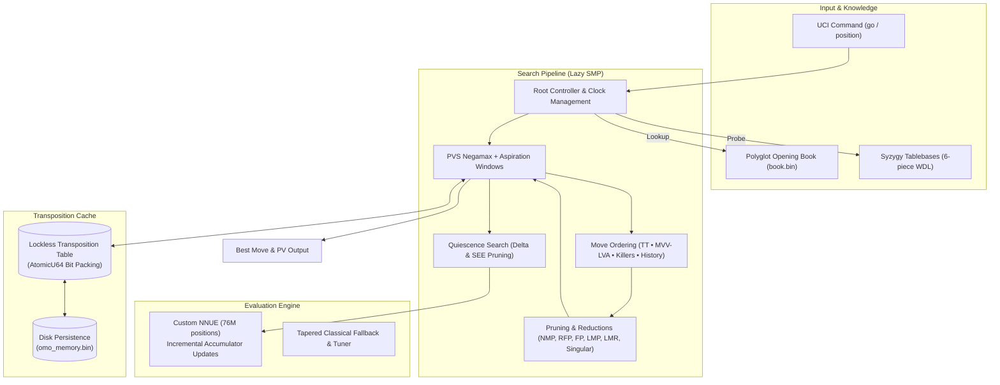

<h1 align="center">OMO</h1>

OMO is a high-performance, multi-threaded UCI chess engine written in pure, memory-safe Rust on top of `cozy-chess`. It pairs a custom **NNUE** evaluation network with an optimized alpha-beta search pipeline featuring modern pruning, reductions, and lockless concurrency.

Play against OMO on Lichess: [lichess.org/@/omo-engine](https://lichess.org/@/omo-engine)

---

## Performance & Benchmarks

OMO achieves an estimated playing strength of **~3245 Elo**, measured through a 150-game tournament test suite against calibrated Stockfish baselines:

| Metric                              | Result                                               |
| :---------------------------------- | :--------------------------------------------------- |
| **Opponent**                        | Stockfish 15 (Skill Level 15 &bull; ~3070 Elo)       |
| **Record**                          | **102W / 32L / 16D** (150 games)                     |
| **Score Rate**                      | **73.3%** (110.0 / 150)                              |
| **Elo Difference**                  | **+176 &plusmn; 58**                                 |
| **Estimated Performance**           | **~3245 Elo**                                        |
| **Likelihood of Superiority (LOS)** | **100.0%**                                           |
| **Draw Ratio**                      | **10.7%**                                            |
| **Color Splits**                    | White: 84.9% (64.5/76) &bull; Black: 61.5% (45.5/74) |

---

## System Architecture

---

## Architecture & Features

### Evaluation

- **Custom NNUE (`omo.nnue`):** Efficiently Updatable Neural Network trained on **76 million positions**, evaluated with incremental accumulator updates on move make/unmake via `nnue-rs`.
- **Classical Eval & Tuner:** Fully parameterized fallback evaluator with tapered phase scoring (MG/EG), piece-square tables, pawn structure evaluation, piece mobility/outposts, and king safety.

### Search Pipeline

- **Principal Variation Search (PVS):** Negamax framework with dynamic aspiration windows.
- **Pruning & Reductions:**
  - **Null Move Pruning (NMP):** Adaptive depth reduction for fast cutoffs.
  - **Reverse Futility Pruning (RFP):** Static evaluation margins at shallow depths.
  - **Futility Pruning (FP):** Prunes unpromising quiet moves near leaf nodes.
  - **Late Move Pruning (LMP):** Skips quiet moves beyond depth-scaled move thresholds ($3 + 2 \times \text{depth}^2$).
  - **Late Move Reductions (LMR):** Logarithmic reductions for late quiet moves.
  - **Static Exchange Evaluation (SEE):** Full ray-caster capture verification to filter bad captures in Quiescence Search and tactical moves.
- **Extensions:** Check extensions and **Singular Extensions** to verify critical TT moves.
- **Quiescence Search:** Tactical capture/promotion resolution with delta pruning and SEE filtering.

### Move Ordering

1. **Transposition Table Move** (Hash Move)
2. **MVV-LVA** (Most Valuable Victim – Least Valuable Attacker)
3. **Killer Move Heuristic** (2 killers per ply)
4. **History & Continuation History:** Tracks move success and refutations against opponent's prior moves.

### Concurrency & System

- **Lockless Lazy SMP:** Multi-threaded parallel search using an atomic 64-bit packed Transposition Table (`AtomicU64`) and staggered thread depths with zero mutex overhead during search.
- **Endgame & Opening Support:** Syzygy endgame tablebase probing (WDL up to 6-piece) and Polyglot opening book (`book.bin`) integration.
- **Persistent Memory (`omo_memory.bin`):** Automatically saves and loads cached Transposition Table entries across sessions.
- **Smart Time Management:** Dynamic soft/hard allocation with panic buffers, sudden score-drop extensions, and instant-stop stability detection.

---

## UCI Commands & Utilities

- `perft` / `perftsuite`: Built-in move generation correctness and speed validation.
- `tactics`: Built-in tactical test suite runner.
- `savememory`: Manual transposition table serialization to disk.

---

## Author

Made with ♟️ by **mintykiera**
